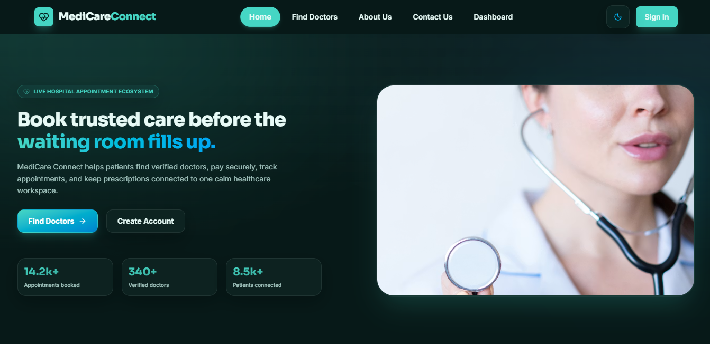
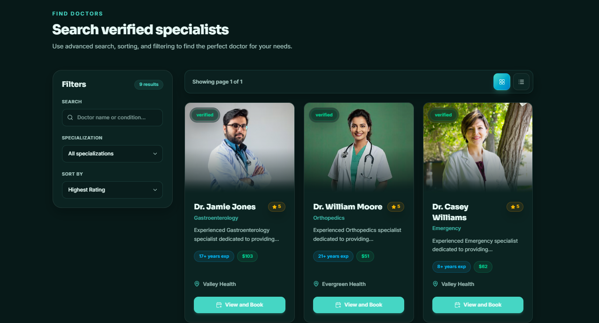
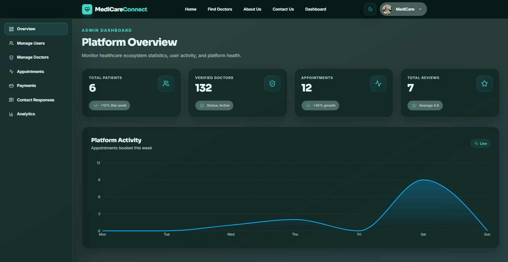

# MediCare Connect

MediCare Connect is a healthcare management web application for finding doctors, booking appointments, managing payments, and coordinating patient, doctor, and admin workflows from role-based dashboards.

[](https://medicareconnectweb.vercel.app/)
[](https://nextjs.org/)
[](https://react.dev/)
[](https://tailwindcss.com/)
[](https://www.mongodb.com/)
[](https://medicareconnectweb.vercel.app/)

## Live Links

- Frontend: [https://medicareconnectweb.vercel.app/](https://medicareconnectweb.vercel.app/)
- Backend API: [https://medicareconnectwebserver.vercel.app/](https://medicareconnectwebserver.vercel.app/)
- Backend repository: [https://github.com/smRid/MediCare-Connect-Server](https://github.com/smRid/MediCare-Connect-Server)

## Preview

<p align="center">
  
  
  
</p>

## Features

- Public healthcare landing page with doctor discovery, service highlights, patient stories, and responsive navigation.
- Doctor search and profile pages with specialization details, availability, consultation fees, reviews, and appointment booking.
- Appointment flow that creates appointments, payment intents, and payment records through the backend API.
- Better Auth authentication with email/password and Google sign-in support.
- Patient dashboard for overview metrics, appointments, payment history, and reviews.
- Doctor dashboard for schedule management, appointment requests, prescriptions, and profile workflows.
- Admin dashboard for users, doctors, appointments, payments, contact responses, and analytics.
- Responsive UI built with Tailwind CSS, Framer Motion, Lucide icons, Recharts, and React Toastify.

## Tech Stack

| Area | Technology |
| --- | --- |
| Framework | Next.js 16 App Router |
| UI | React 19, Tailwind CSS 4, Framer Motion |
| Auth | Better Auth, Google OAuth |
| Database/Auth storage | MongoDB |
| Charts | Recharts |
| Icons | Lucide React |
| Notifications | React Toastify |
| Deployment | Vercel |

## Project Structure

```text
PHA10-MediCare-Connect/
|-- public/
|   |-- preview1.png
|   |-- preview2.png
|   |-- preview3.png
|   `-- favicon.svg
|-- src/
|   |-- app/
|   |   |-- (auth)/
|   |   |-- (main)/
|   |   |-- api/auth/[...all]/
|   |   |-- dashboard/
|   |   |-- layout.js
|   |   `-- page.js
|   |-- components/
|   |   |-- dashboardPage/
|   |   |-- doctors/
|   |   |-- homepage/
|   |   |-- payment/
|   |   |-- shared/
|   |   `-- ui/
|   |-- constants/
|   `-- lib/
|       |-- api/
|       |-- auth.jsx
|       |-- auth-client.jsx
|       `-- auth-context.jsx
|-- next.config.mjs
|-- package.json
`-- README.md
```

## Environment Variables

Create a `.env.local` file in the project root.

```env
# App URLs
NEXT_PUBLIC_APP_URL=http://localhost:3000
NEXT_PUBLIC_API_BASE_URL=http://localhost:5000

# MongoDB
MONGODB_URI=mongodb://127.0.0.1:27017/medicare_connect
MONGODB_DB=medicare_connect

# Better Auth
BETTER_AUTH_URL=http://localhost:3000
BETTER_AUTH_SECRET=replace-with-a-strong-secret
BETTER_AUTH_API_KEY=replace-with-your-better-auth-api-key

# Google OAuth
GOOGLE_CLIENT_ID=replace-with-google-client-id
GOOGLE_CLIENT_SECRET=replace-with-google-client-secret
```

Notes:

- `NEXT_PUBLIC_API_BASE_URL` can point to either the API origin or the `/api` path. The app normalizes it automatically.
- `MONGO_DB_URI` is also supported as an alternative to `MONGODB_URI`.
- Google OAuth values are required only when Google sign-in is enabled.

For production, configure the same variables in Vercel. Typical production values:

```env
NEXT_PUBLIC_APP_URL=https://medicareconnectweb.vercel.app
NEXT_PUBLIC_API_BASE_URL=https://medicareconnectwebserver.vercel.app/api
BETTER_AUTH_URL=https://medicareconnectweb.vercel.app
```

## Getting Started

Requirements:

- Node.js 20.9 or newer
- npm
- MongoDB connection string
- Running backend API server

Install dependencies:

```bash
npm install
```

Start the development server:

```bash
npm run dev
```

Open [http://localhost:3000](http://localhost:3000) in your browser.

Run linting:

```bash
npm run lint
```

Build for production:

```bash
npm run build
```

Start the production server:

```bash
npm start
```

## Main Routes

| Route | Purpose |
| --- | --- |
| `/` | Home page |
| `/find-doctors` | Doctor browsing and search |
| `/doctors/[id]` | Doctor profile and booking |
| `/about` | About page |
| `/contact` | Contact page |
| `/login` | Sign in |
| `/register` | Create account |
| `/dashboard/patient` | Patient dashboard |
| `/dashboard/doctor` | Doctor dashboard |
| `/dashboard/admin` | Admin dashboard |

## Deployment

The frontend is deployed on Vercel. Before deploying:

1. Add all production environment variables in the Vercel project settings.
2. Set `NEXT_PUBLIC_API_BASE_URL` to the deployed backend API.
3. Set `BETTER_AUTH_URL` and `NEXT_PUBLIC_APP_URL` to the deployed frontend URL.
4. Allow the production deployment to access MongoDB.
5. Configure Google OAuth redirect origins for the production domain.
6. Redeploy after changing environment variables.

## Credits

Built with Next.js, React, Tailwind CSS, Better Auth, MongoDB, and Vercel.
